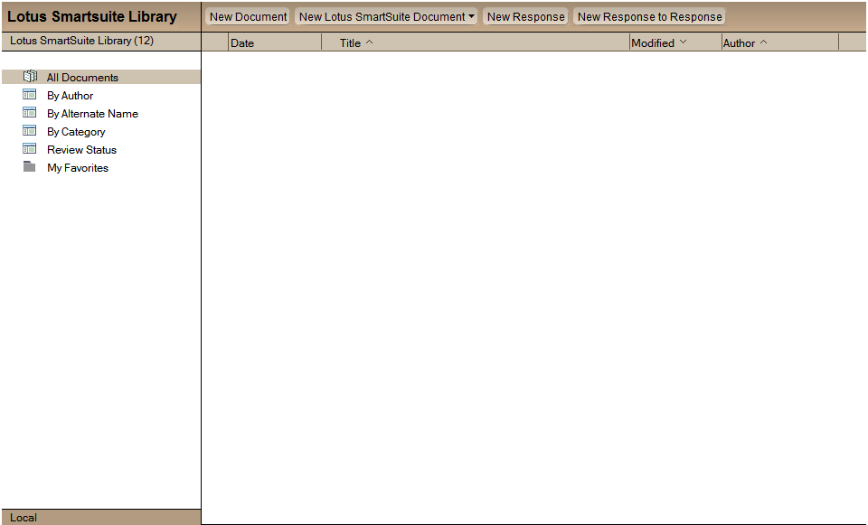

<h1>Lotus SmartSuite Millennium Edition Document Library</h1>

  

    Table of contents
  

  {: .text-delta }
1. TOC
{:toc}

## Info

Property | Value   
---|---
Filename | doclbs7.ntf
Templatename | StdSmartSuiteR7DocLib
Template version | 12.0 (03.11.2020)
Signed by | Open Source Template/Domino Development
Optimized for | Notes Client

**This template is not intended for Web (browser) use and is not supported on the Macintosh

This database allows you to capture and track information about documents.

## Functions of the Database:

### To add a document to this database
Click the New Document action from any of the views.  You can enter document information in several ways: by typing it using the Notes editor, by scanning in hard copy, or by importing or attaching an electronic file. 

To create a document using Lotus SmartSuite applications
Select Create--Lotus SmartSuite or select the New Lotus SmartSuite document action bar, and then select one of the following choices: 1-2-3 Workbook; Freelance Presentation; Paintbrush Picture; Word Pro Document).  In order for these documents to get created properly you will need to have these applications installed (Lotus SmartSuite 9 applications or above are supported).

### To respond to a document
Highlight that document in a view, then select Create, Response.

### To respond to a response
Highlight the response you wish to respond to, then select Create, Response to Response.

### To flag a document as Private
You can use the "Mark Private" and "Mark Public" actions in the template to control whether anyone other than yourself can read a specific document.  For example, if you have not completed the writing of a particular document, you can click the "Mark Private" action and others will not be able to see the document.  When you complete the document, you can click the "Mark Public" action to make it available for others to read.  If a document is marked private after it has been submitted for review, the document author and the reviewers will be able to read the document.

### ACL Settings
This application was designed with the intention that all users, except the Manager, should have Author access.  If they have Editor access, the review cycle may not function properly.  Anonymous access is not permitted.

## Features

### Document Review Cycle
The author of a document has the option of setting up a document review cycle for that document. To do so simply click on the Setup Review Cycle action button and fill in the necessary information.  
Note:  Do not use @Domain when entering approver names.  Any domain added will be stripped off and may cause complications when attempting to route a request.  Also, only enter Person-names as approvers.  Group names are not supported.

### Clearing a Review Cycle
This database provides an action button to "Clear Review Cycle".  This is accessible only by the document's originator.  You can either use the action prior to submitting a document for review, or after submittal.  Below are the guidelines:
- Clearing a review cycle prior to submitting for review:  Select this if you, as originator, wish to change the review cycle settings before your reviewers receive notification.
- Clearing a review cycle after submittal:  If reviewers have already begun or completed their document review, their work will be preserved.  If reviewers were notified to review a document and they have not yet begun the review, they will receive a courtesy notice that they are no longer required to conduct a review.

### Lotus SmartSuite Library Review Styles
Serial Review:  Documents are routed for review one at a time, in sequence to the reviewers chosen by the author.
- All edits are made within the same document, but an unedited copy of the original document is also saved.
Serial Review (keep all revisions):  Documents are routed for review one at a time, in sequence to the reviewers chosen by the author.
- Edits are made within a copy of the original, which also includes all comments from previous reviewers
- All old versions become response documents (as well as a copy of the original)
Document Reservations:  Requests for document review are routed in parallel (that is, all at the same time).  When one reviewer opens the document, a "file locking" occurs at the server which warns any other user who happens to edit the document that a review is in progress.  
- Review comments or edits are made into a copy of the original document
- As with the others, a clean copy of the original is always kept
Response Review:  Same as Document Reservations (but with no file locking).
- Review comments or edits are saved as response documents to the original document.  
- As with the others, a clean copy of the original is always kept

### Processing Late Reviews
If the Process Late Reviews agent is enabled, it selects those documents which are in review and have due dates which have passed.  Based upon the review style of the document, it then either moves it along to the next reviewer, marks it as complete, or simply notifies the current reviewer(s) that their review is overdue.

### Unlock Document
Occasionally a document is accidentally left in a locked state.  The Unlock Document action can be accessed by designers and managers from the Review Status view's Action menu to unlock the document.

### Archiving
To set up Archiving for the Lotus SmartSuite Library, click the Archive button on the second tab of the File-Database-Properties infobox.  Fill out the information and click the OK button.  Set up the Archiving task is to run on the server.  An archive database will be set up automatically.

### Marking documents as "Expired"  
The Archive feature can act upon documents that have been marked as Expired.  Select a document in the view and choose Mark/Unmark Expired from the Actions menu.

### Categorize multiple documents  
You can categorize several document by selecting each document and then select Actions, Categorize.  Then you can select a category or add a new one and press OK when finished.  Now your selected documents will be categorized.

### OLE/ActiveX
This template is designed to work with Lotus SmartSuite Millennium Edition r9 or later (earlier versions of SmartSuite are not supported since most of these applications did not support DocObjects.  This template takes advantage of the OLE concept of DocObjects (aka ActiveX) which basically involves the OLE/ActiveX object going in-place active and taking over the entire document window.  The affect is that it appears as if the object's server is running as a stand-alone application.

Please see the Troubleshooting section in the Notes Client release notes for information regarding any known issues with this template.

## For Administrators:

This database was designed around the notion that the end-user will be spending the majority of their time in the Notes environment. This template will not work if a user tries to use the "Save to Lotus Notes" feature that Lotus 1-2-3 r9, Lotus Freelance r9, and Lotus Word Pro r9 include. If someone saves a document to this database in that manner, the user will receive and error if the try to open the document from Notes, not from within the SmartSuite product. We suggest that you have your users either 1) create and open documents from within Notes or 2) create and open documents from within the SmartSuite application.